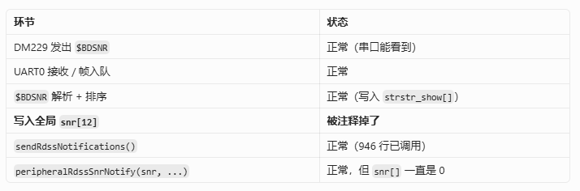
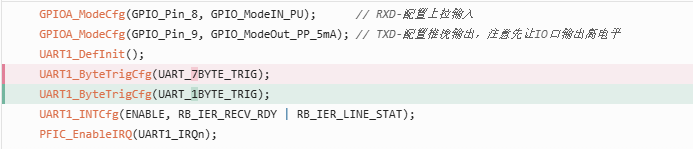
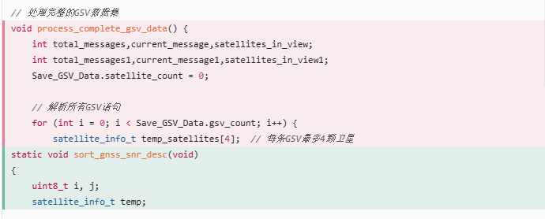
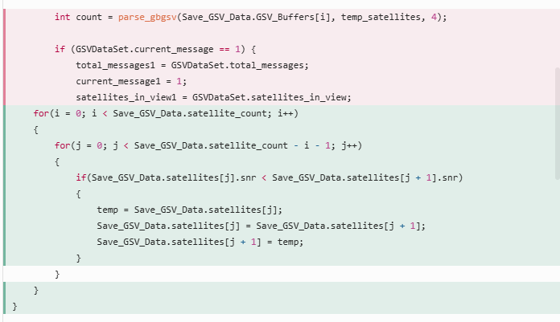
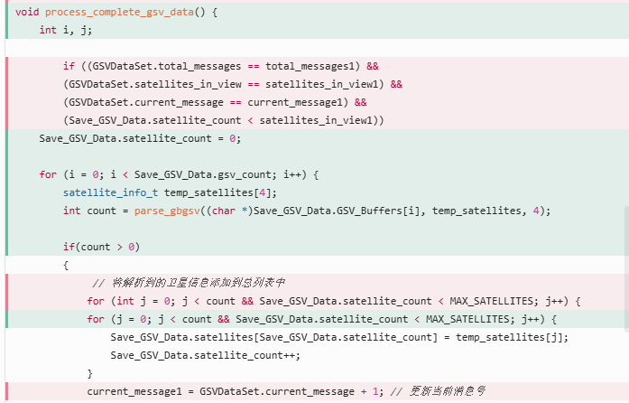
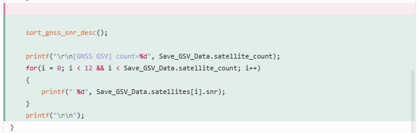
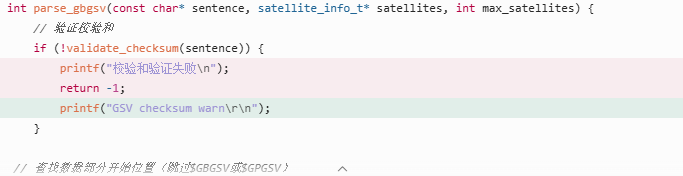
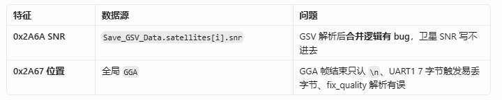

# 7.1修改
## rdss的snr上传

固定数据能上传、DM229 也有 SNR，但蓝牙全是 0，说明问题在 $BDSNR 解析到 snr[] 或 Notify 打包这一段。我先查当前代码链路
```

			for(i=0; i<12; i++)
			{
				snr[i] = strstr_show[i];
			}
			printf("\r\n[RDSS SNR] ");
			for(i=0; i<12; i++)
			{
				printf("%d ", snr[i]);
			}
			printf("\r\n");
```

DM229 → UART0 → $BDSNR 解析 → snr[12] → sendRdssNotifications() → 0x4503 Notify

```
// 原来被注释掉：
// snr[i] = strstr_show[i];
```

## gnss数据上传
GNSS 和 RDSS SNR 一样， 先查 GGA/GSV 解析后是否写进了 GGA 和 Save_GSV_Data，以及 performPeriodicTask 是否在用这些变量上传。

首先串口一也改为每次只接受一个bit的数据

改处理





和 RDSS SNR 是同一类问题：模块有数据，但全局变量没填上，蓝牙上传的就是初始值 0。BLE 上传路径本身没问题
